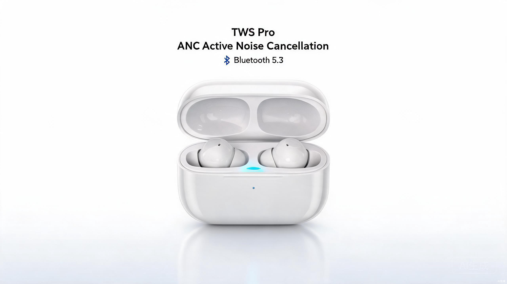

# E-commerce Content Agent

> 电商内容生产 Agent：商品理解 → 文案生成 → SEO → 合规检查 → 质量评分 → 自动重写 → 图片生成 → 短视频生成 → 多平台适配

[](https://www.python.org/)
[](LICENSE)
[](https://fastapi.tiangolo.com/)
[](https://github.com/QwenLM/Qwen3)

## 项目简介

面向电商卖家的多 Agent 内容生产系统。以商品结构化信息为输入，通过 8 个业务 Agent 完成「商品理解 → 文案生成 → SEO 优化 → 合规审核 → 质量评分 → 自动重写 → 图片生成 → 短视频生成」流程。文本侧支持 Mock、vLLM、Transformers + LoRA 和 OpenAI 兼容 API；视觉侧已实现 Seedream、Seedance 客户端及 Mock 链路。

> 当前状态：Mock 文案全链路已验证；图片和视频链路均已有真实 API 产物（见下方「真实产物展示」）；Qwen3-8B QLoRA 配置和脚本已就绪，训练结果尚未产出。

### 核心特点

- **Agent 闭环**：生成 → 评分 → 重写 → 再评分，低质量内容自动优化，最多 N 轮迭代
- **图片生成**：按平台构建图片 prompt，Seedream API 已生成真实产物（见 `docs/showcase/`）
- **短视频生成**：按平台构建视频 prompt，Seedance API 已生成真实产物（见 `docs/showcase/`）
- **微调模型接入**：支持通过 Transformers + LoRA 或 vLLM 加载微调结果；当前训练主线为 Qwen3-8B
- **多平台适配**：淘宝、Amazon、抖音、小红书 四种平台风格，不同模板和语气
- **四维质量评估**：LLM-as-Judge（准确性/吸引力/合规性/SEO）+ ROUGE-L + 确定性指标
- **三路对比**：base model vs fine-tuned vs fine-tuned+rewrite，量化微调和重写的价值
- **容器化部署**：Docker / Docker Compose 启动 Mock API，并提供 `vllm`、`full` 可选 profile
- **隐私安全**：所有 API Key 和模型路径通过 `.env` 文件管理，不进入版本控制

## 功能全景

### 已实现功能

| 功能模块 | 说明 | 状态 |
|---------|------|------|
| 商品理解 | 自动解析属性、提炼卖点（3-5个）、推断目标人群和使用场景 | ✅ |
| 多平台文案生成 | 标题优化 + 五点卖点 + 详情页描述 + 社媒推广文案 | ✅ |
| SEO 关键词 | 核心搜索词（5-10个）+ 长尾词（3-5个）+ 品类词 | ✅ |
| 合规检查 | 确定性规则（13+ 广告法违禁词）+ LLM 双重审核 | ✅ |
| 质量评分 | LLM-as-Judge 四维评分（准确性/吸引力/合规性/SEO） | ✅ |
| 自动重写 | 根据低分维度定向重写，保持已通过部分不变 | ✅ |
| 产品图片生成 | 自动构建图片 prompt；Seedream API 已生成真实产物（见 docs/showcase） | ✅ |
| 短视频生成 | 自动构建视频 prompt；Seedance API 已生成真实产物（见 docs/showcase） | ✅ |
| 三路模型对比 | 评估脚本已实现；需训练产物后执行完整对比 | 🟡 |
| 4 种模型后端 | Mock / vLLM / Transformers+LoRA / 外部 API 统一切换 | ✅ |
| Docker 部署 | Mock API 配置已提供；GPU/vLLM profile 仍沿用 14B 路径，使用前需按本地模型调整 | 🟡 |
| 环境变量管理 | `.env` 文件统一管理 API Key、模型路径等隐私配置 | ✅ |

### 规划中功能

| 功能模块 | 说明 | 优先级 |
|---------|------|--------|
| Listing 优化 Agent | 基于竞品分析 + 平台规则，优化 Listing 排名 | 高 |
| RAG 知识库 | 平台规则、品牌资料、商品目录、竞品信息的向量检索增强 | 高 |
| LangGraph 编排 | Supervisor 动态路由 + Checkpoint 持久化 | 中 |
| 异步任务 + SSE | 任务队列 + 实时推送生成进度 | 低 |

## 真实产物展示

以下产物均由项目 Agent 链路真实生成，原图/视频存放在 `docs/showcase/`。

### 产品展示图（Seedream API）

由 ImageGenerationAgent 构建平台 prompt 后调用 Seedream API 生成（TWS Pro 真无线降噪耳机 · 淘宝白底图风格）：



### 产品短视频（Seedance API）

由 VideoGenerationAgent 构建视频 prompt 后调用 Seedance API 生成（小米手环 8 Pro · 抖音展示风格）：

[▶ 观看产品短视频](docs/showcase/xiaomi_band8_pro.mp4)

### 文案示例

由 CopywritingAgent + SEOAgent + ComplianceAgent + JudgeAgent 全链路生成（TWS Pro 真无线降噪耳机 · 淘宝平台）：

> **标题**：【主动降噪】TWS Pro真无线蓝牙耳机 30小时续航 IPX5防水
>
> **五点卖点**：
> 1. ANC主动降噪，沉浸式聆听体验
> 2. 30小时复合续航，一周一充无忧
> 3. IPX5级防水防汗，运动健身不受限
> 4. 13mm生物振膜动圈，HiFi级音质表现
> 5. 蓝牙5.3技术，游戏低延迟不断连
>
> **详情页描述**：XX品牌 TWS Pro 真无线降噪耳机，采用 ANC 主动降噪技术，有效屏蔽通勤、办公环境噪音。13mm 生物振膜动圈搭配蓝牙 5.3 芯片，带来 HiFi 级音质与超低延迟游戏体验。IPX5 防水等级，运动出汗无忧。复合续航达 30 小时，一周一充，告别电量焦虑。
>
> **社媒文案**：通勤路上太吵？健身房里总被打断？这款TWS Pro降噪耳机真的拯救了我！ANC一开整个世界都安静了～续航30小时一周不充电，IPX5防水运动随便造 #降噪耳机 #真无线耳机 #TWSPro
>
> **SEO 关键词**：降噪耳机 / 真无线蓝牙耳机 / TWS耳机 / 主动降噪 / 长续航耳机
>
> **质量评分**：准确性 4/5 | 吸引力 4/5 | 合规性 5/5 | SEO 3/5 | 总分 4.05/5（通过）

## 环境配置

### .env 文件

所有 API Key、模型路径、生成参数等隐私/可变配置统一通过 `.env` 文件管理，不进入 Git 版本控制。

```bash
# 从模板创建配置文件
cp .env.example .env
```

### 配置项说明

| 配置项 | 默认值 | 说明 |
|--------|--------|------|
| `MODEL_BACKEND` | `mock` | 模型后端：mock / vllm / transformers / api |
| `MODEL_NAME` | `ecommerce-copywriter` | 模型名称（vLLM/api 后端使用） |
| `API_BASE` | `http://localhost:8000/v1` | API 服务地址 |
| `API_KEY` | `not-needed` | API 密钥（外部 API 使用） |
| `MODEL_PATH` | `models/Qwen3-8B-Instruct` | 本地模型路径 |
| `LORA_PATH` | `output/ecommerce_qlora_sft_8b` | LoRA adapter 路径 |
| `TEMPERATURE` | `0.7` | 生成温度 |
| `TOP_P` | `0.9` | Nucleus sampling 阈值 |
| `MAX_TOKENS` | `1024` | 最大生成 token 数 |
| `API_HOST` | `127.0.0.1` | API 监听地址；无鉴权时不要直接暴露公网 |
| `API_PORT` | `8888` | API 端口 |
| `MAX_REWRITE_ROUNDS` | `2` | 最大重写轮次 |
| `VIDEO_BACKEND` | （空） | 视频后端：留空禁用 / `mock` / `api` |
| `SEEDANCE_API_KEY` | （空） | Seedance API 密钥（火山引擎方舟） |
| `SEEDANCE_MODEL` | （空） | 方舟控制台中已开通的模型或推理接入点 ID |
| `SEEDANCE_CREATE_URL` | 方舟内容任务接口 | 视频任务提交地址 |
| `SEEDANCE_QUERY_URL` | 方舟内容任务接口 | 视频任务查询地址 |
| `VIDEO_DURATION` | `5` | 视频时长（秒）：5 / 10 |
| `VIDEO_RESOLUTION` | `720p` | 视频分辨率：720p / 1080p |
| `IMAGE_BACKEND` | （空） | 图片后端：留空禁用 / `mock` / `api` |
| `SEEDREAM_API_KEY` | （空） | Seedream API 密钥（火山引擎方舟） |
| `SEEDREAM_MODEL` | （空） | 方舟控制台中已开通的模型或推理接入点 ID |
| `SEEDREAM_API_URL` | 方舟图片生成接口 | 图片生成地址 |
| `IMAGE_SIZE` | `landscape_16_9` | 图片尺寸：square / portrait_4_3 / portrait_16_9 / landscape_4_3 / landscape_16_9 |
| `MEDIA_OUTPUT_DIR` | `output` | 图片、视频和任务数据库的持久目录 |
| `TASK_DB_PATH` | `output/tasks.db` | SQLite 任务数据库 |

### 模型后端切换

```powershell
# Mock 模式（开发测试，无需 GPU）
$env:MODEL_BACKEND="mock"

# vLLM 推理服务
$env:MODEL_BACKEND="vllm"
$env:API_BASE="http://localhost:8000/v1"

# 本地 Transformers + LoRA
$env:MODEL_BACKEND="transformers"
$env:MODEL_PATH="models/Qwen3-8B-Instruct"
$env:LORA_PATH="output/ecommerce_qlora_sft_8b"

# 外部 API（OpenAI / DashScope）
$env:MODEL_BACKEND="api"
$env:API_BASE="https://api.openai.com/v1"
$env:API_KEY="<你的文本模型 API Key>"
```

### 视频生成配置

```powershell
# Mock 模式（开发测试，不调用真实 API）
$env:VIDEO_BACKEND="mock"

# Seedance API 模式（需要火山引擎方舟 API Key）
$env:VIDEO_BACKEND="api"
$env:SEEDANCE_API_KEY="<你的方舟 API Key>"
$env:SEEDANCE_MODEL="<控制台中的模型或接入点 ID>"

# 不启用视频生成（留空或不设置）
# $env:VIDEO_BACKEND=""
```

### 图片生成配置

```powershell
# Mock 模式（开发测试，不调用真实 API）
$env:IMAGE_BACKEND="mock"

# Seedream API 模式（需要火山引擎方舟 API Key）
$env:IMAGE_BACKEND="api"
$env:SEEDREAM_API_KEY="<你的方舟 API Key>"
$env:SEEDREAM_MODEL="<控制台中的模型或接入点 ID>"

# 不启用图片生成（留空或不设置）
# $env:IMAGE_BACKEND=""
```

## 快速开始

### 前置要求

- Python 3.10+
- (可选) CUDA 12.1+ / NVIDIA GPU（用于模型推理和训练）
- (可选) Docker（用于容器化部署）

### 1. 安装依赖

```powershell
# 安装运行依赖
pip install -r requirements.txt

# 完整安装（含训练依赖）
pip install torch transformers datasets accelerate peft bitsandbytes vllm
```

### 2. 配置环境

```powershell
# 从模板创建 .env 文件
copy .env.example .env

# 编辑 .env 填入你的 API Key（如使用外部 API）
# 默认使用 Mock 模式，无需任何修改即可运行
```

### 3. 验证完整 Mock 链路（无需 GPU）

```powershell
python quick_start.py

# 仅验证文案链路
python quick_start.py --no-image --no-video

# 使用自定义商品列表
python quick_start.py --product examples/sample_products.json
```

默认演示文案 → 评分 → 重写判断 → 图片 → 视频流程。图片和视频输出为 `.placeholder` 占位文件，不是真实媒体。示例进度：

```
使用 Mock 模型客户端（无需 GPU）

[1/8] 商品理解...
  卖点: ['主动降噪技术', '30小时超长续航', ...]
  目标人群: 18-35岁都市白领、通勤族、运动爱好者

[2/8] 文案生成...
  标题: 【主动降噪】TWS Pro真无线蓝牙耳机 30小时续航 IPX5防水
  卖点数: 5

[3/8] SEO 关键词...
  关键词: ['降噪耳机', '真无线蓝牙耳机', ...]

[4/8] 合规检查...
  合规: 通过

[5/8] 质量评分...
  准确性: 4/5 | 吸引力: 4/5 | 合规性: 5/5 | SEO: 3/5
  总分: 4.05/5 (通过)

[6/8] 质量达标，无需重写
[7/8] 图片生成...
  状态: completed
[8/8] 视频生成...
  状态: completed
```

### 4. 启动 API 服务

```powershell
# Mock 模式（默认）
python -m uvicorn src.api.server:app --port 8888

# 或直接运行（自动读取 .env 配置）
python src/api/server.py
```

### 5. Docker 部署

```bash
# 构建并启动（Mock 模式）
docker-compose up -d

# 启动 vLLM 推理 + API 联合服务（需要 NVIDIA GPU；先修改 compose 中的模型和 LoRA 路径）
docker-compose --profile vllm --profile full up -d
```

> `docker-compose.yml` 的 vLLM 服务当前指向 `Qwen3-14B-Instruct` 和 `output/ecommerce_qlora_sft`，与当前 8B 训练主线不同；使用 GPU profile 前请按实际模型目录修改。
>
> 当前生产基线是本地虚拟环境直接运行。Docker 配置尚未纳入本轮真实多模态上线验收。

## API 文档

### 接口列表

| 接口 | 方法 | 说明 |
|------|------|------|
| `/generate` | POST | 生成电商文案（Pydantic 校验输入输出） |
| `/generate/image` | POST | 生成电商文案 + 产品展示图 |
| `/generate/video` | POST | 创建文案 + 视频异步任务，返回 HTTP 202 |
| `/generate/all` | POST | 创建文案 + 图片 + 视频异步任务，返回 HTTP 202 |
| `/tasks/{task_id}` | GET | 查询异步任务状态和结果 |
| `/health` | GET | 健康检查 |
| `/ready` | GET | 配置、SQLite 和输出目录就绪检查 |

交互式 OpenAPI 文档在服务启动后可访问 `http://localhost:8888/docs`。

> 后端未配置时媒体接口返回 HTTP 503。Mock 后端返回占位文件；`api` 后端请求真实媒体。视频任务状态持久化在 SQLite，服务重启后会恢复未完成任务。

### POST /generate

**请求体**：

```json
{
  "title": "无线蓝牙耳机",
  "category": "3c_digital",
  "attributes": {
    "蓝牙版本": "5.3",
    "降噪类型": "主动降噪ANC",
    "续航时间": "30小时（含充电仓）",
    "防水等级": "IPX5",
    "驱动单元": "13mm动圈"
  },
  "selling_points": [],
  "target_audience": "",
  "price_positioning": "mid",
  "platform": "taobao",
  "tone": "trendy",
  "constraints": []
}
```

**响应体**：

```json
{
  "optimized_title": "【主动降噪】TWS Pro真无线蓝牙耳机 30小时续航 IPX5防水",
  "selling_points": [
    "ANC主动降噪，沉浸式聆听体验",
    "30小时复合续航，一周一充无忧",
    "IPX5级防水防汗，运动健身不受限",
    "13mm生物振膜动圈，HiFi级音质表现",
    "蓝牙5.3技术，游戏低延迟不断连"
  ],
  "description": "XX品牌 TWS Pro 真无线降噪耳机...",
  "seo_keywords": ["降噪耳机", "真无线蓝牙耳机", "TWS耳机", "主动降噪", "长续航耳机"],
  "social_copy": "通勤路上太吵？健身房里总被打断？这款TWS Pro降噪耳机真的拯救了我...",
  "quality_score": {
    "accuracy": {"score": 4, "reason": "产品属性准确，无虚构信息"},
    "attractiveness": {"score": 4, "reason": "卖点突出，描述有吸引力"},
    "compliance": {"score": 5, "reason": "无广告法违禁词"},
    "seo": {"score": 3, "reason": "关键词覆盖尚可，长尾词可加强"},
    "total": 4.05,
    "passed": true
  },
  "rewrite_reason": "",
  "rewrite_history": [],
  "platform": "taobao"
}
```

### POST /generate/video

创建文案 + 视频异步任务。请求体在 `/generate` 基础上增加可选的 `custom_video_prompt`。

```json
{
  "title": "便携式蓝牙音箱 防水重低音 户外露营必备",
  "category": "数码",
  "attributes": {
    "品牌": "SoundBox",
    "电池续航": "12小时",
    "防水等级": "IPX7"
  },
  "platform": "douyin",
  "custom_video_prompt": ""
}
```

接口立即返回 HTTP 202：

```json
{
  "task_id": "9ddfe21a...",
  "kind": "video",
  "status": "queued",
  "status_url": "/tasks/9ddfe21a..."
}
```

### POST /generate/image

同步生成文案 + 产品展示图。请求体在 `/generate` 基础上增加可选的 `custom_image_prompt`，成功时返回完整内容包及 `image` 字段。

```json
{
  "title": "XX品牌 TWS Pro 真无线降噪耳机",
  "category": "3c_digital",
  "attributes": {
    "蓝牙版本": "5.3",
    "降噪类型": "主动降噪ANC",
    "续航时间": "30小时"
  },
  "platform": "taobao",
  "custom_image_prompt": ""
}
```

**响应体**（在 `/generate` 基础上增加 `image` 字段）：

```json
{
  "optimized_title": "【主动降噪】TWS Pro真无线蓝牙耳机 30小时续航 IPX5防水",
  "selling_points": ["...", "..."],
  "description": "...",
  "seo_keywords": ["降噪耳机", "真无线蓝牙耳机", "..."],
  "social_copy": "通勤路上太吵？这款降噪耳机真的拯救了我...",
  "quality_score": {"total": 4.05, "passed": true, "...": "..."},
  "rewrite_reason": "",
  "rewrite_history": [],
  "platform": "taobao",
  "image": {
    "image_prompt": "[电商产品展示图...] 产品置于白色桌面上，侧面展示ANC标识...",
    "task_id": "d9a3b7c2-xxxx-xxxx",
    "status": "completed",
    "image_url": "https://...",
    "local_path": "output/image/d9a3b7c2.png",
    "platform": "taobao",
    "image_size": "square"
  }
}
```

### POST /generate/all

创建文案 + 图片 + 视频异步任务，需要同时配置图片和视频后端。

**请求体**（在 `/generate` 基础上增加 `custom_image_prompt` 和 `custom_video_prompt`）：

```json
{
  "title": "XX品牌 TWS Pro 真无线降噪耳机",
  "category": "3c_digital",
  "attributes": {"蓝牙版本": "5.3", "降噪类型": "主动降噪ANC"},
  "platform": "douyin",
  "custom_image_prompt": "",
  "custom_video_prompt": ""
}
```

接口返回 HTTP 202，格式与视频任务一致，`kind` 为 `all`。

### GET /tasks/{task_id}

返回 `queued`、`running`、`succeeded` 或 `failed`。成功结果位于 `result`，失败详情位于 `error`；`upstream_task_id` 是方舟视频任务 ID。

### curl 示例

```bash
# 生成淘宝文案
curl -X POST http://localhost:8888/generate \
  -H "Content-Type: application/json" \
  -d '{
    "title": "无线蓝牙耳机",
    "category": "3c_digital",
    "platform": "taobao",
    "tone": "trendy",
    "attributes": {"蓝牙版本": "5.3", "续航": "30小时"}
  }'

# 生成 Amazon 英文文案
curl -X POST http://localhost:8888/generate \
  -H "Content-Type: application/json" \
  -d '{
    "title": "Wireless Bluetooth Earbuds",
    "category": "3c_digital",
    "platform": "amazon",
    "tone": "professional",
    "attributes": {"Bluetooth": "5.3", "Battery": "30 hours"}
  }'

# 生成文案 + 产品短视频（需要配置 VIDEO_BACKEND）
curl -X POST http://localhost:8888/generate/video \
  -H "Content-Type: application/json" \
  -d '{
    "title": "便携式蓝牙音箱 防水重低音",
    "category": "数码",
    "platform": "douyin",
    "attributes": {"防水等级": "IPX7", "续航": "12小时"}
  }'

# 生成文案 + 产品展示图（需要配置 IMAGE_BACKEND）
curl -X POST http://localhost:8888/generate/image \
  -H "Content-Type: application/json" \
  -d '{
    "title": "XX品牌 TWS Pro 真无线降噪耳机",
    "category": "3c_digital",
    "platform": "taobao",
    "attributes": {"蓝牙版本": "5.3", "降噪": "主动降噪ANC"}
  }'

# 一键生成文案 + 图片 + 短视频（需要同时配置 IMAGE_BACKEND 和 VIDEO_BACKEND）
curl -X POST http://localhost:8888/generate/all \
  -H "Content-Type: application/json" \
  -d '{
    "title": "XX品牌 TWS Pro 真无线降噪耳机",
    "category": "3c_digital",
    "platform": "douyin",
    "attributes": {"蓝牙版本": "5.3", "续航": "30小时"}
  }'

# 健康检查
curl http://localhost:8888/health

# 视频和 all 接口返回 202 后，使用响应中的 task_id 查询
curl http://localhost:8888/tasks/<task_id>
```

## 多平台内容生成

系统支持四种平台的内容生成，每种平台有独立的模板和文案风格：

| 平台 | 语言 | 风格特点 | 输出内容 |
|------|------|---------|---------|
| 淘宝 | 中文 | 专业卖点型，突出参数和性价比 | 标题 + 五点卖点 + 详情页描述 |
| Amazon | 英文 | 规范 Listing 型，Bullet Points + Description | Title + Bullet Points + Description |
| 抖音 | 中文 | 种草推荐型，口语化、场景化、带话题标签 | 短视频口播文案 + 话题标签 |
| 小红书 | 中文 | 真实分享型，个人体验视角、emoji 点缀 | 种草笔记 + 标签 + emoji |

### 平台风格示例

**淘宝**（专业卖点型）：
> 【主动降噪】TWS Pro真无线蓝牙耳机 30小时续航 IPX5防水

**Amazon**（规范 Listing 型）：
> [ANC Noise Cancelling] TWS Pro Wireless Earbuds, 30H Battery Life, IPX5 Waterproof, Bluetooth 5.3

**抖音**（种草推荐型）：
> 通勤路上太吵？健身房里总被打断？这款TWS Pro降噪耳机真的拯救了我！

**小红书**（真实分享型）：
> ✨ 终于找到通勤+运动都能用的降噪耳机了！ANC一开整个世界都安静了～

## 合规与质量保障

### 广告法合规检查

系统内置 **13+ 广告法违禁词** 的确定性规则检测，覆盖：

- **绝对化用语**：最、第一、顶级、极品、独一无二、万能、国家级
- **虚假宣传**：永久、100%、纯天然、无副作用
- **敏感词**：治愈、根治

确定性规则 + LLM 审核双重保障，高风险内容自动进入重写流程。

### 四维质量评估

| 维度 | 权重 | 评估内容 | 评分标准 |
|------|------|---------|---------|
| 准确性 | 35% | 属性值、规格、品牌是否与原文一致 | 1-5 分，无虚构信息得 5 分 |
| 吸引力 | 30% | 语言流畅度、卖点突显、购买欲望 | 1-5 分，有场景化描述得 5 分 |
| 合规性 | 20% | 广告法违禁词、虚假宣传检测 | 1-5 分，无违禁词得 5 分 |
| SEO 覆盖 | 15% | 关键词密度、标题结构、标签覆盖 | 1-5 分，核心词+长尾词覆盖得 5 分 |

**质量阈值**：总分 ≥ 3.5 分（满分 5 分），不达标自动触发重写。

## 评估体系

### 三路对比评估

| 对比维度 | Base Model | Fine-tuned | Fine-tuned + Rewrite |
|---------|------------|------------|---------------------|
| 文案质量 | 通用风格 | 电商垂直优化 | 电商垂直 + 自动优化 |
| SEO 覆盖 | 一般 | 针对性提升 | 最佳 |
| 合规性 | 可能违规 | 已学习电商规范 | 双重保障 |
| 量化价值 | 基线 | 微调收益 | 闭环收益 |

### 评估指标

- **LLM-as-Judge**：四维加权评分（准确性 35% / 吸引力 30% / 合规性 20% / SEO 15%）
- **ROUGE-L**：基于 LCS 的文本相似度（支持 jieba 分词 / 字符级回退）
- **确定性指标**：长度比、2-gram 重复率、首尾完整性

## 数据工程

### 数据来源

全部为真实公开数据集，无模拟数据。

| 数据集 | 来源 | 规模 | 本项目用量 | 协议 |
|--------|------|------|-----------|------|
| AdvertiseGen | 清华 CoAI | 114K 条 | 2,000 条（服装类专家样本） | CC BY-NC 4.0 |
| 天池商品描述 | 阿里云天池 | 212 万条 | 18,000 条（9 品类均衡） | CC BY-NC 4.0 |

最终数据集：**19,885 条**，**9 品类均衡**（3c_digital / clothing / beauty / food / home / maternity_baby / auto / sports_outdoor / other），Alpaca 格式，**8:1:1** 划分。

### 数据增强

针对公开电商数据集缺少完整结构化商品属性和高质量标注文案的问题，采用 LLM 辅助数据增强 + 人工质量控制策略。

### 下载与预处理

```powershell
# 下载数据集
python data/download_datasets.py

# 预处理为 Alpaca 格式
python data/preprocess.py
```

## 模型与训练

### 训练方案

| 配置 | 模型 | 目标硬件 | 状态 |
|------|------|---------|------|
| `configs/train_config_8b.yaml` | Qwen3-8B Dense | RTX 5070 Ti 12GB | 当前本地训练方案，尚无训练产物 |
| `configs/train_config.yaml` | Qwen3-14B Dense | Linux 大显存 GPU | Windows 本地加载受阻，保留备用 |
| `configs/grpo_config.yaml` | Qwen3.5-35B-A3B MoE | A100/H100 云端环境 | 实验配置，尚未执行 |

### QLoRA 训练配置

| 参数 | 14B 方案 | 8B 方案（当前） |
|------|---------|---------------|
| 量化 | 4-bit NF4 + 双重量化 | 4-bit NF4 + 双重量化 |
| LoRA rank | 64 | 64 |
| LoRA alpha | 128 | 128 |
| LoRA target | all | all |
| 学习率 | 2e-4 (cosine) | 2e-4 (cosine) |
| batch size | 4 × 4 (有效 16) | 1 × 16 (有效 16) |
| epochs | 3 | 3 |
| 序列长度 | 1024 | 768 |

> **注意**：Qwen3-14B 在 Windows 上因 mmap 兼容性问题无法加载（27.5GB safetensors 文件触发内存访问冲突），已切换至 Qwen3-8B。Linux 环境无此问题。

### 模型切换

通过统一接口切换后端，无需修改 Agent 代码：

```python
from src.inference.model_client import create_client, ModelConfig

# Mock 模式（开发测试）
client = create_client(ModelConfig(backend="mock"))

# Transformers + LoRA（本地推理）
client = create_client(ModelConfig(
    backend="transformers",
    model_path="models/Qwen3-8B-Instruct",
    lora_path="output/ecommerce_qlora_sft_8b"
))

# vLLM 服务（高性能推理）
client = create_client(ModelConfig(
    backend="vllm",
    api_base="http://localhost:8000/v1"
))

# 外部 API（OpenAI / DashScope）
client = create_client(ModelConfig(
    backend="api",
    api_base="https://api.openai.com/v1",
    api_key="sk-xxxxxxxx"
))
```

## 同类项目对比

| 项目 | 定位 | 电商专注度 | 多 Agent | 微调模型 | 图文视频 | 开源 |
|------|------|-----------|---------|---------|---------|------|
| **本项目** | 电商内容生产闭环 | ⭐⭐⭐⭐⭐ | 8 Agent | Qwen3 QLoRA（训练中） | 图片+视频真实产物已附 | ✅ |
| [EcomGPT](https://github.com/Alibaba-NLP/EcomGPT) | 电商指令微调 LLM | ⭐⭐⭐⭐⭐ | ❌ | BLOOMZ | ❌ | ✅ |
| [KOBE](https://github.com/THUDM/KOBE) | 知识驱动产品描述 | ⭐⭐⭐⭐ | ❌ | Seq2Seq | ❌ | ✅ |
| [ecommerce-ai-roadmap](https://github.com/kangise/ecommerce-ai-roadmap) | 电商 AI 知识库 | ⭐⭐⭐⭐⭐ | Prompt 工程 | ❌ | ❌ | ✅ |
| [amazon-skills](https://github.com/zach22-1999/amazon-skills) | Listing 优化 Skill | ⭐⭐⭐⭐ | Agent Skills | ❌ | ❌ | ✅ |
| [CrewAI](https://github.com/crewAIInc/crewAI) | 通用多 Agent 框架 | ⭐⭐ | 可定制 | ❌ | ❌ | ✅ |
| [MetaGPT](https://github.com/geekan/MetaGPT) | 多 Agent 元编程 | ⭐⭐ | SOP 协作 | ❌ | ❌ | ✅ |

**本项目的差异化优势**：
1. **电商垂直深耕**：非通用 Agent 框架，而是专为电商内容生产设计的完整闭环
2. **微调接口就绪**：已提供 QLoRA 配置及 LoRA/vLLM 推理接口，训练与对比结果待产出
3. **质量闭环**：生成 → 评分 → 重写 → 再评分的自动优化机制
4. **多平台原生**：淘宝/Amazon/抖音/小红书四种平台模板，非通用翻译
5. **图文视频链路**：图片和视频均已有真实 API 产物（Seedream + Seedance），附在 `docs/showcase/`

## 项目结构

```
ecommerce-copywriter-llm/
├── src/
│   ├── schemas.py                  # ProductProfile, ContentPackage, QualityScore
│   ├── agents/
│   │   ├── base.py                 # BaseAgent 基类
│   │   ├── product_understanding.py # 商品理解 Agent
│   │   ├── copywriting.py          # 文案生成（多平台适配）
│   │   ├── seo.py                  # SEO 关键词 Agent
│   │   ├── compliance.py           # 合规检查（确定性规则 + LLM）
│   │   ├── judge.py                # LLM-as-Judge 四维评分
│   │   ├── rewrite.py              # 自动重写 Agent
│   │   ├── video_generation.py     # 视频生成 Agent（Seedance 集成）
│   │   ├── image_generation.py     # 图片生成 Agent（Seedream 集成）
│   │   └── orchestrator.py         # Agent 编排器
│   ├── inference/
│   │   ├── model_client.py         # 统一文本模型接口（vLLM/Transformers/API/Mock）
│   │   ├── video_client.py         # 视频生成客户端（Seedance API / Mock）
│   │   └── image_client.py         # 图片生成客户端（Seedream API / Mock）
│   ├── evaluation/
│   │   ├── metrics.py              # ROUGE-L + 确定性指标
│   │   └── judge.py                # 批量评估 + 三路对比
│   └── api/
│       └── server.py               # FastAPI 服务（从 .env 读取配置）
├── data/                           # 数据工程
│   ├── labeled/                    # Alpaca 格式数据集
│   ├── raw/                        # 原始数据集
│   ├── preprocess.py               # 数据预处理
│   └── download_datasets.py        # 数据集下载
├── configs/                        # 训练配置
│   ├── train_config.yaml           # Qwen3-14B QLoRA 配置
│   ├── train_config_8b.yaml        # Qwen3-8B QLoRA 配置
│   └── grpo_config.yaml            # GRPO 对齐训练配置
├── scripts/                        # 运维脚本
│   ├── setup_env.ps1               # 一键环境安装
│   ├── download_model.py           # 模型下载
│   ├── train_local.ps1             # 本地训练启动
│   ├── serve.ps1                   # vLLM 推理服务
│   ├── serve_api.ps1               # FastAPI 服务启动
│   └── compare_models.py           # 三路对比评估
├── examples/
│   └── sample_products.json        # 示例商品（3 个品类）
├── quick_start.py                  # 快速启动（Mock 模式，无需 GPU）
├── .env.example                    # 环境变量配置模板
├── .env                            # 环境变量（不进入 Git）
├── Dockerfile                      # Docker 构建
├── docker-compose.yml              # Docker Compose 编排
├── README.md
└── LICENSE
```

## 技术栈

| 组件 | 技术 |
|------|------|
| Agent 架构 | 自研多 Agent 编排（BaseAgent + Orchestrator） |
| 训练框架 | LLaMA-Factory |
| 微调方法 | QLoRA 4-bit (bitsandbytes + NF4 + 双重量化) |
| 评估 | LLM-as-Judge + ROUGE-L + 确定性指标 |
| 推理引擎 | vLLM |
| 图片生成 | 火山引擎方舟 Seedream API（真实产物已附） / Mock |
| 视频生成 | 火山引擎方舟 Seedance API（真实产物已附） / Mock |
| API 服务 | FastAPI + Pydantic v2 |
| 配置管理 | python-dotenv + .env |
| 容器化 | Docker + Docker Compose |
| 基座模型配置 | Qwen3-8B（当前）/ Qwen3-14B（备用）/ Qwen3.5-35B-A3B（GRPO 实验配置） |

## 迭代计划

| 阶段 | 目标 | 状态 |
|------|------|------|
| Iteration 0 | 项目整理与范围收敛 | ✅ 完成 |
| Iteration 1 | 文案生成 Agent MVP + 6 个业务 Agent 闭环 | ✅ 完成 |
| Iteration 2 | 接入微调模型 + 三路对比评估 | 🔄 进行中（8B 配置就绪，待训练） |
| Iteration 3 | 短视频生成 Agent（多平台 prompt + Mock/Seedance 客户端） | ✅ Seedance 真实产物已附 |
| Iteration 4 | 图片生成 Agent（多平台 prompt + Mock/Seedream 客户端） | ✅ Seedream 真实产物已附 |
| Iteration 5 | Listing 优化 Agent（竞品分析 + 平台规则） | 📋 规划中 |
| Iteration 6 | RAG 知识库（平台规则 + 品牌资料 + 商品目录） | 📋 规划中 |
| Iteration 7 | LangGraph 编排 + Supervisor 路由 + Checkpoint | 📋 规划中 |
| Iteration 8 | 异步任务队列 + SSE + 批量生成 | 📋 远期 |

## License

MIT License - 详见 [LICENSE](LICENSE)

数据集遵循各自原始协议：
- AdvertiseGen: CC BY-NC 4.0
- 天池商品描述: CC BY-NC 4.0
